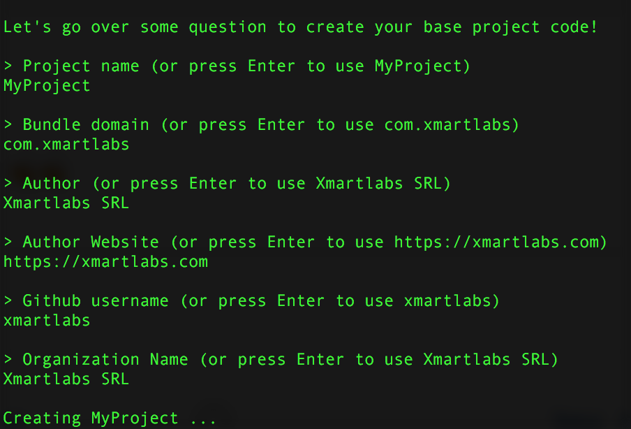

# Swift-Project-Template

[](https://travis-ci.org/xmartlabs/Swift-Project-Template)

Create your iOS Base project in just a few seconds by executing a script and answering some project questions. This is what we use to get started with a new iOS project from scratch!

Swift Project Template provides us with a base iOS project template along with and a swift script to make naming customizations on it.

Currently you can find the project template under the [master](/tree/master) branch and a more complete example project (including more example files) under the [ExampleProject](/tree/ExampleProject) branch.

iOS project has the following configuration:

* Targets
  * Test: Unit tests working with Quick and Nimble.
  * UITest: Functional tests working with Nimble matcher.
  * App Production Target.
  * App Staging Target. Same app source code with a different bundle id, it points to a different Restful API (staging one).

* Project Configuration
  * R-Swift integration.
  * Warnings for TODO and FIXME comments.
  * Swift Lint integration.
  * Crashlytics integration.
  * `travis.yml` file.
  * `podfile` containing most used libraries by us.
    - Realm, Decodable, Alamofire, RxSwift, Eureka, Opera and many others.

* Networking
  * `Alamofire` networking library.
  * `Opera` network abstraction layer integrated along with some examples.


##### Usage

Clone the repository:

```shell
git clone git@github.com:xmartlabs/Swift-Project-Template.git
```
Run `shell.swift` script from there:

```swift
swift -target x86_64-apple-macosx10.11 Swift-Project-Template/shell.swift
```

Answer some questions:



We are done! Now start coding your app! 🍻🍻
